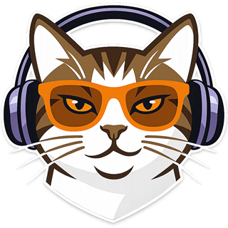

# Catboard

**Voice-cloning soundboard for Discord and VRChat.**

  
  
  

&nbsp;

### Status

Catboard is in **closed beta**, and builds go to invited testers only. Public releases will be published under this repository's [Releases](https://github.com/dime-online/catboard/releases) in the future. To hear when they land, use **Watch → Custom → Releases** at the top of this page.

### Consent first

Catboard is for your own voice and the voices of people who've agreed to it. Its terms of use require consent.

### Not open source

Catboard is proprietary software. Its source code is private, and this repository holds only this page. See [LICENSE](LICENSE).

&nbsp;

© 2026 Dime · <a href="https://github.com/dime-online">@dime-online</a>

