  <picture>
    <source media="(max-width: 600px)" srcset="https://raw.githubusercontent.com/dime-online/catboard/main/assets/hero-mobile.cc332939.svg" />
    
  </picture>
    
  
  
  

 

<picture>
  <source media="(max-width: 600px)" srcset="https://raw.githubusercontent.com/dime-online/catboard/main/assets/app-mobile.2ce7b68e.svg" />
  
</picture>

### Two ways to use a voice

**Soundboard**, rendered clips. Type a line, get a clip in that voice, keep it on a pad, and fire it with one key.

**Live**, real time and in testing. Talk, and the lobby hears the voice as you speak.

### Also on board

- **Make a voice** from a short recording of yourself, or of a friend who's said yes.
- **Every voice gets its own board**: twelve pads, one key each.
- **Plays through your mic**, so it works wherever your mic does: Discord, VRChat, TeamSpeak, in-game voice chat.

### Status

Catboard is in **closed beta**, and builds go to invited testers only. Public releases will be published under this repository's [Releases](https://github.com/dime-online/catboard/releases) in the future. To hear when they land, use **Watch → Custom → Releases** at the top of this page.

### Consent and privacy

Catboard is for your own voice and the voices of people who've agreed to it. Its terms of use require consent. Your voices and clips stay on your PC.

### Not open source

Catboard is proprietary software. Its source code is private, and this repository holds only this page. See [LICENSE](LICENSE).

 

© 2026 Dime · <a href="https://github.com/dime-online">@dime-online</a>

